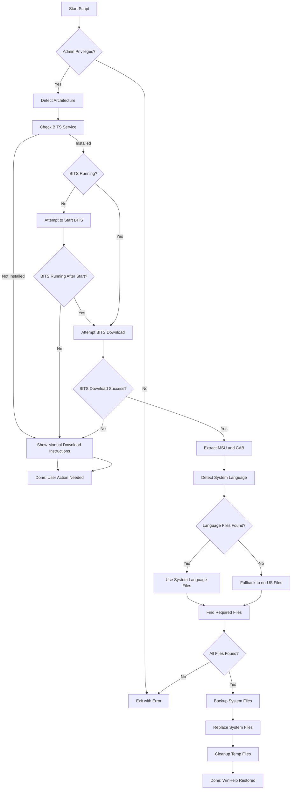

# hlp4win11 - Legacy `HLP` file support for Windows 11

So, you have some old HLP files or legacy applications which use them, but that old help system is not supported anymore on your Windows 11? You came to the right place! This PowerShell script restores legacy `.hlp` file support on Windows 11 by automatically downloading, extracting, and installing the official Microsoft WinHlp32 components from KB917607 originally made for Windows 8.1. Since Microsoft no longer supports applying KB917607 directly on Windows 11, this script streamlines the complex manual process, including architecture detection, language fallback, and safe file replacement with backups. It also works on Windows 10.


## Table of Contents

- [Overview](#overview)
- [Features](#features)
- [Prerequisites](#prerequisites)
- [Installation & Usage](#installation--usage)
- [How It Works](#how-it-works)
- [Troubleshooting](#troubleshooting)
- [License](#license)
- [Credits](#credits)


## Overview

Microsoft deprecated support for `.hlp` (WinHelp) files in Windows Vista and later.
While Microsoft provides an update (KB917607) to restore this functionality, it is not officially available for Windows 10/11 and requires manual extraction and patching.

`hlp4win11.ps1` automates this process:

- Downloads the correct KB917607 update for your system (x64 or x86)
- Extracts the necessary WinHlp32 binaries and language files
- Backs up existing system files with sequential versioning
- Installs the components, enabling `.hlp` file viewing on Windows 11
- Gracefully handles BITS unavailability or download failures by providing manual download instructions


## Features

- **Automatic architecture detection** (x64 or x86)
- **Language-aware extraction**: uses your system UI language if available, otherwise falls back to American English
- **Safe file replacement**: sequential backups (`.01.bkp`, `.02.bkp`, etc.) before overwriting system files
- **BITS download with progress** when available
- **Manual download fallback** if BITS is disabled, unavailable, or download fails
- **Minimal user interaction**: mostly unattended once started
- **Cleanup of temporary files** after installation


## Prerequisites

- **Windows 11** (also works on Windows 10)

- **PowerShell 3.0 or newer**

- **Administrator privileges** (script enforces this)

- **Internet access** to download the update (or manual download fallback)

- **Execution Policy**

Execution Policy can be either set to allow script execution before running hlp4win11.ps1:

```powershell
Set-ExecutionPolicy RemoteSigned
```

or temporarily bypassed by running script from PowerShell using this command:

```powershell
powershell.exe -ExecutionPolicy Bypass -File .\hlp4win11.ps1
```

If you forget to open PowerShell as Administrator, then script will stop execution and warn you about it.


## Installation & Usage

### 1. Download and Prepare

Save `hlp4win11.ps1` to a **local directory on your root drive**, e.g.:

```javascript
C:\hlp4win11\hlp4win11.ps1
```

> **Note:** Running from a network or mapped drive may cause download issues because BITS cannot download to network locations. Always use a local NTFS drive.

### 2. Open PowerShell as Administrator

Search for **PowerShell** on your Windows 11, right-click, and select **Run as administrator**.

### 3. Navigate to the script directory:

```powershell
cd C:\hlp4win11
```

### 4. Run the script:

```powershell
powershell.exe -ExecutionPolicy Bypass -File .\hlp4win11.ps1
```

### 5. If prompted to manually download the update:

- The script will provide a direct download link for the KB917607 MSU file.
- Download it using your browser.
- Save it **in the same directory as the script**.
- Rerun the script.

### 6. Completion

If successful, `.hlp` files should now open natively on your Windows 11 system.
If a major Windows update overwrites the patched files, **simply rerun the script**.


## How It Works





## Troubleshooting

- **BITS errors or download failures:**
 The script will provide a direct download link. Download the KB917607 MSU manually and place it in the script directory, then rerun the script.
- **Script exits with "Must be run as Administrator":**
 Right-click PowerShell and select **Run as administrator**.
- **After Windows Update, `.hlp` files stop working:**
 Rerun the script to restore the legacy files.
- **Language-specific UI missing:**
 The script falls back to American English if your language MUI files are unavailable in original KB917607.
- **Microsoft changes download page:**
 The script relies on parsing static HTML; if this breaks, manually download the MSU file and place it alongside the script.
- **BITS cannot download to network drives:**
 Always run the script from a local NTFS drive, not a mapped network location.


## License

- This project is licensed under the [Mozilla Public License 2.0 (MPL-2.0)](https://www.mozilla.org/en-US/MPL/2.0/).
- [License explained in plain English](https://www.tldrlegal.com/license/mozilla-public-license-2-0-mpl-2)


## Credits

- Inspired by various community scripts and manual guides which all stopped working after some Windows update.
- Microsoft for providing the original KB917607 update packages.


## Support the Project

If this project has helped you, support is most welcome:

- ⭐ **Star the repository** to show your appreciation.
- 💬 Share your feedback or success stories in the **Discussions**.