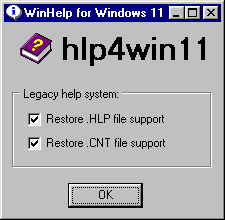
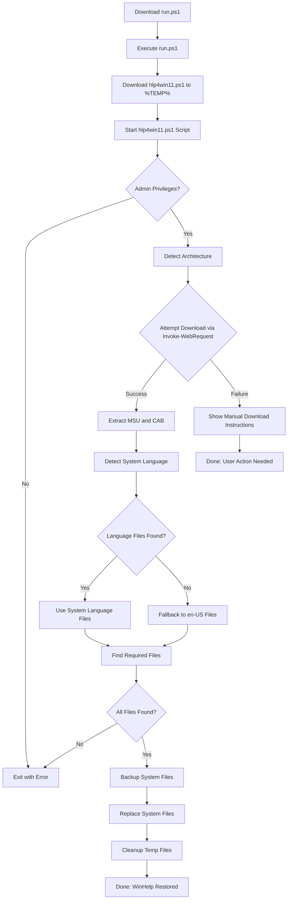

# hlp4win11 - Legacy `HLP` file support for Windows 11

So, you have some old HLP files or legacy applications which use them, but that old help system is not supported anymore on your Windows 11? You came to the right place! This project restores legacy `.hlp` file support on Windows 11 by automatically downloading, extracting, and installing the official Microsoft WinHlp32 components from KB917607 originally made for Windows 8.1. Since Microsoft no longer supports applying KB917607 directly on Windows 11, this script streamlines the complex manual process, including architecture detection, language fallback, and safe file replacement with backups. It also works on Windows 10.

It now includes a simple one-command installer for ease of use. If you want to skip the details then simply jump to [Quick Install](#quick-install-recommended).


## Table of Contents

- [Overview](#overview)
- [Features](#features)
- [Prerequisites](#prerequisites)
- [Installation & Usage](#installation--usage)
  - [Quick Install (Recommended)](#quick-install-recommended)
  - [Manual Installation](#manual-installation)
- [How It Works](#how-it-works)
- [Troubleshooting](#troubleshooting)
- [License](#license)
- [Credits](#credits)


## Overview

Support for `.hlp` (WinHelp) files was deprecated in Windows Vista and later. While Microsoft provides an update (KB917607) to restore this functionality for Windows 8.1, it is not officially available for Windows 10/11 and adapting it requires a lot of manual extraction and patching.

`hlp4win11` automates this process:

- **Easy Install:** A single command downloads and runs the installer.
- Downloads the correct KB917607 update for your system (x64 or x86) using `Invoke-WebRequest`.
- Extracts the necessary WinHlp32 binaries and language files.
- Backs up existing system files with sequential versioning.
- Installs the components, enabling `.hlp` file viewing on Windows 11.
- Gracefully handles download failures by providing manual download instructions.


## Features

- **One-Command Install:** Uses `irm ... | iex` for quick setup.
- **Automatic architecture detection** (x64 or x86).
- **Language-aware extraction**: uses your system UI language if available, otherwise falls back to American English (en-US).
- **Safe file replacement**: sequential backups (`.01.bkp`, `.02.bkp`, etc.) before overwriting system files.
- **Download via Invoke-WebRequest**: Uses standard PowerShell cmdlet for downloading (shows progress automatically on PowerShell 5.0+).
- **Manual download fallback** if automatic download fails.
- **Minimal user interaction**: mostly unattended once started.
- **Cleanup of temporary files** after installation.


## Prerequisites

- **Windows 11** (also works on Windows 10)
- **PowerShell 3.0 or newer**
- **Administrator privileges** (script enforces this)
- **Internet access** for the Quick Install or to download the update (KB917607) manually.
- **Execution Policy**
    - The **Quick Install** command (`irm ... | iex`) implicitly bypasses the execution policy for the initial bootstrap script download. The main script then runs with bypass automatically.
    - For the **Manual Installation** method, the Execution Policy can be either set globally beforehand (`Set-ExecutionPolicy RemoteSigned`) or bypassed temporarily when running the script (`powershell.exe -ExecutionPolicy Bypass -File .\hlp4win11.ps1`).
    - If you forget to open PowerShell as Administrator, the script will stop and warn you.


## Installation & Usage


### Quick Install (Recommended)

This is the easiest way to install `hlp4win11`, using a single command that automates the download and setup process.

1.  **Open PowerShell as Administrator**: Search for **PowerShell**, right-click, and select **Run as administrator**.
2.  **Run the Installation Command**: Paste the following into the Administrator PowerShell window and press Enter:

    ```powershell
    irm https://raw.githubusercontent.com/zeljkoavramovic/hlp4win11/main/run.ps1 | iex
    ```
3.  **Follow On-Screen Prompts**:

    The main installer script (`hlp4win11.ps1`) will now run and guide you through the rest of the process (component download, extraction, installation).

4.  **How it works**:

    1.  This method uses a small bootstrap script (`run.ps1`) hosted on GitHub. When you run the installation command, PowerShell downloads the `run.ps1` script content using `irm`.
    2.  The `| iex` part executes that script content directly from memory without saving to disk.
    3.  The `run.ps1` script then automatically downloads the main installer (`hlp4win11.ps1`) to your temporary directory (`%TEMP%\hlp4win11`).
    4.  Finally, it launches the main installer script with the necessary permissions to perform the WinHelp restoration. This eliminates the need for manual downloads and simplifies the process significantly.

5.  **Why is `run.ps1` needed:**

    The `run.ps1`  script serves as a necessary bootstrap installer for the one-command **Quick Install** method. While `irm ... | iex` is convenient for fetching and running remote scripts, it executes them directly from memory, meaning the script has no defined file path on your disk ($PSScriptRoot is invalid). This poses a problem because the main `hlp4win11.ps1` installer relies on knowing its own directory to locate the KB917607 MSU file if you need to download it manually as a fallback (for instance, if the automatic download fails or Microsoft changes the URL). This fallback capability is essential even if setting up for a mostly **offline installation**. Therefore, `run.ps1` bridges this gap: it gets executed by `irm ... | iex`, downloads the full `hlp4win11.ps1`  script to a temporary folder on your disk, and then launches the main script *from that disk location*, ensuring it has the valid path required for its essential fallback mechanisms to function correctly.


### Manual Installation

Use this method if the Quick Install fails (e.g., due to network restrictions) or if you prefer to download the script manually. Only `hlp4win11.ps1` is needed. Script `run.ps1` is not needed for manual installation.

1.  **Download the Script**:

    *   Go to the `hlp4win11.ps1` script page: [https://github.com/zeljkoavramovic/hlp4win11/blob/main/hlp4win11.ps1](https://github.com/zeljkoavramovic/hlp4win11/blob/main/hlp4win11.ps1)
    *   Click the "Raw" button or the download button to get the script file.
    *   Save `hlp4win11.ps1` to a **local directory**, e.g., `C:\hlp4win11\hlp4win11.ps1`.
    > **Note:** While `Invoke-WebRequest` (used for downloads) can write to network drives, running the script manually from a local drive is recommended for simplicity and to ensure the manual download fallback (placing the MSU file alongside the script) works reliably without potential network permission issues.

2.  **Open PowerShell as Administrator**: Search for **PowerShell**, right-click, and select **Run as administrator**.

3.  **Navigate to the script directory**:
    ```powershell
    cd C:\hlp4win11
    ```

4.  **Run the script** (adjust path if needed):
    ```powershell
    powershell.exe -ExecutionPolicy Bypass -File .\hlp4win11.ps1
    ```

5.  **If prompted to manually download the update**:
    *   The script will provide instructions and potentially a download link for the KB917607 MSU file.
    *   Download it using your browser.
    *   Save it **in the same directory as the script** (`C:\hlp4win11` in this example).
    *   Rerun the script (`powershell.exe -ExecutionPolicy Bypass -File .\hlp4win11.ps1`).


### Completion

If successful (using either method), `.hlp` files should now open natively on your Windows 11/10 system.
If a major Windows update overwrites the patched files, **simply rerun the Quick Install command or the manual script**.


## How It Works



## Troubleshooting

-   **`irm` or `iex` command fails (Quick Install):**
    *   Ensure you have active internet connectivity.
    *   Check if your firewall or antivirus is blocking the connection to `raw.githubusercontent.com`.
    *   On older systems, you might need to enable newer TLS versions in PowerShell first: `[Net.ServicePointManager]::SecurityProtocol = [Net.SecurityProtocolType]::Tls12`. (Though the script targets Win 10/11 where this is usually fine).
    *   If the command consistently fails, use the **Manual Installation** method instead.
-   **Download failures (during script execution):**
    *   The script uses `Invoke-WebRequest` to download the MSU file. Failures can occur due to network issues, firewall blocks, temporary server problems, or changes to the Microsoft download page structure/URL.
    *   The script will detect the failure and provide instructions to manually download the required MSU file.
    *   Follow the instructions: download the file, save it with the correct name (`Windows8.1-KB917607-x64.msu` or `...-x86.msu`) in the same directory as `hlp4win11.ps1` (for manual install) or in `%TEMP%\hlp4win11` (if quick install failed mid-way), then rerun the script manually (`powershell.exe -ExecutionPolicy Bypass -File path\to\hlp4win11.ps1`).
-   **Script exits with "Must be run as Administrator":**
    Right-click PowerShell (or Windows Terminal) and select **Run as administrator** before running the install command or script.
-   **After Windows Update, `.hlp` files stop working:**
    Rerun the **Quick Install** command or the **Manual Installation** script to restore the legacy files.
-   **Language-specific UI missing:**
    The script falls back to American English if your language MUI files are unavailable in the original KB917607 package. WinHelp should still function, but menus/dialogs will be in English.
-   **Microsoft changes download page/link structure:**
    The script relies on parsing static HTML for the MSU download link. If Microsoft changes the page structure, automatic download might fail. The script should then provide manual download instructions. If the *manual link itself* is broken, you may need to search for `KB917607 download` for your architecture (x64/x86 for Windows 8.1). Place the downloaded MSU file alongside the script (manual install) or in `%TEMP%\hlp4win11` and rerun manually.


## License

-   This project is licensed under the [Mozilla Public License 2.0 (MPL-2.0)](https://www.mozilla.org/en-US/MPL/2.0/).
-   [License explained in plain English](https://www.tldrlegal.com/license/mozilla-public-license-2-0-mpl-2)


## Credits

-   Inspired by various community scripts and manual guides which all stopped working after some Windows update.
-   Microsoft for providing the original KB917607 update packages.


## Support the Project

If this project has helped you, support is most welcome:

-   ⭐ **Star the repository** to show your appreciation.
-   💬 Share your feedback or success stories in [Discussions](https://github.com/zeljkoavramovic/hlp4win11/discussions/1).